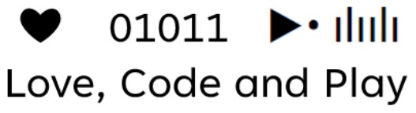

  <!-- Profile Image -->
  <!--  -->
   

  <!-- About Section -->
  <link href="https://fonts.googleapis.com/css2?family=Poppins:wght@400;500;600&display=swap" rel="stylesheet">

  <!-- p style="font-family: 'Poppins', sans-serif; font-size: 1rem; text-align: center; margin: 20px 0; color: #333; line-height: 1.7;">
    
      Generative AI
    
  

  

    Music Producer → 
    <a href="https://www.instagram.com/buonamusika/?hl=en" style="color: #0366d6; text-decoration: none; font-weight: 500;">
      Buonamusika
    </a> 
    Guitarist → 
    <a href="https://it.wikipedia.org/wiki/Lingalad" style="color: #0366d6; text-decoration: none; font-weight: 500;">
      Lingalad
    </a>
  </p-->
  <!-- Footer Image -->
  

